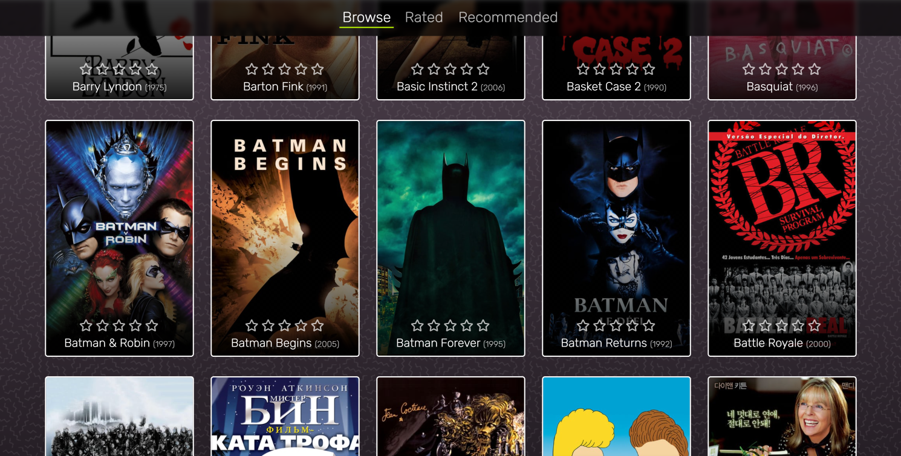

# Movie Recommender

A standalone client-sided application built with react, for educational value on user-based collaborative filtering recommender systems. In practice, an official application would require an accompanying server to provide a scalable service to many users and on larger sets of data.

## Data Sources
A [Kaggle Movie Dataset](https://www.kaggle.com/rounakbanik/the-movies-dataset) was used for the foundation of the movie data, with TMBd (The Movie Database) poster image links scrapped using the [TMDb API](https://developers.themoviedb.org/3). The application runs on a subset of 1000 movies & applicable user ratings from the dataset.
